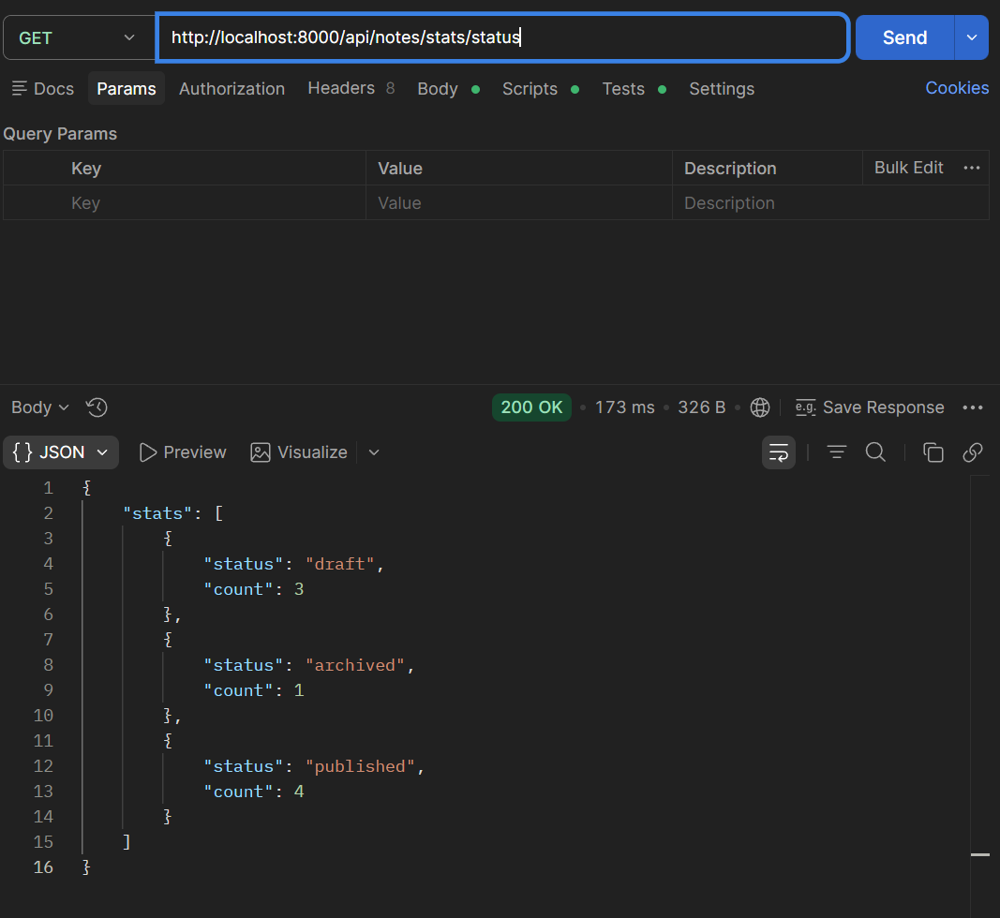
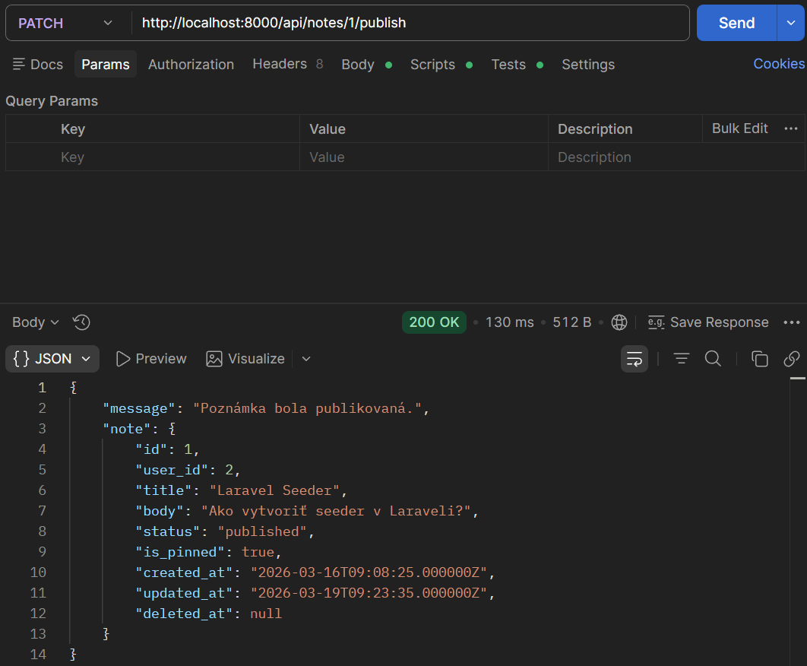
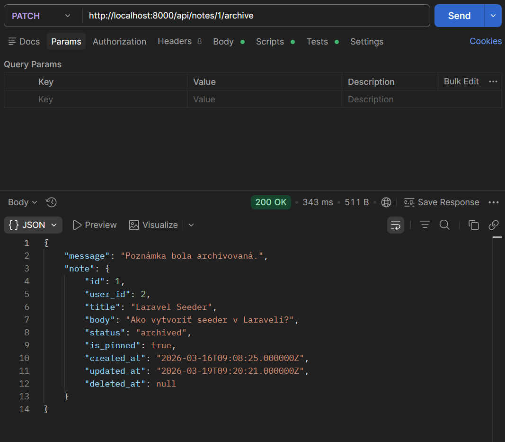
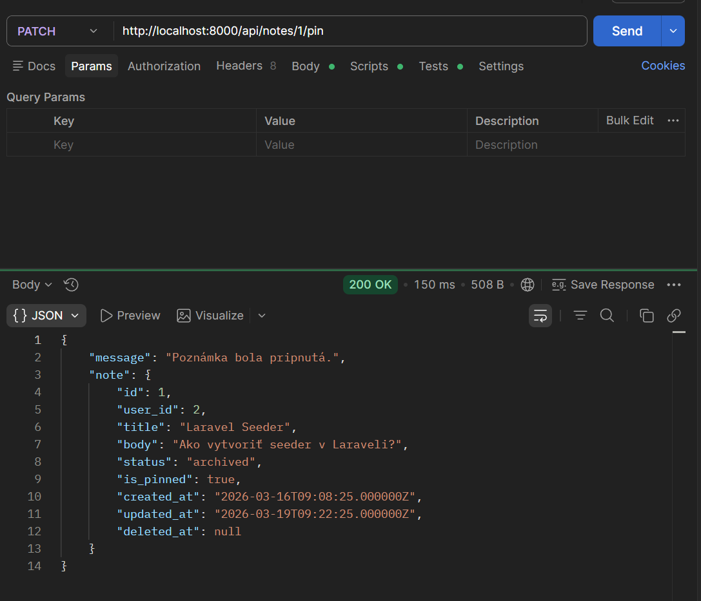
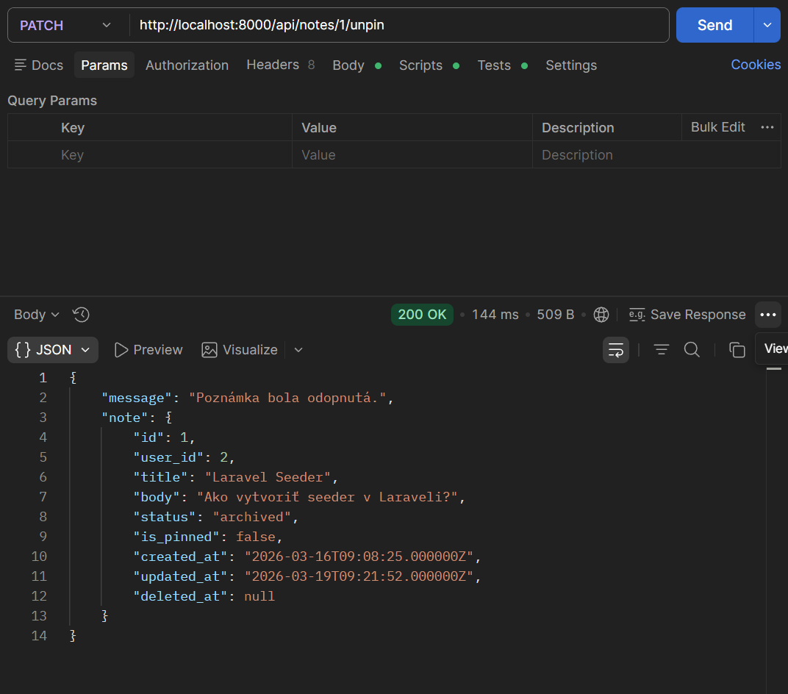
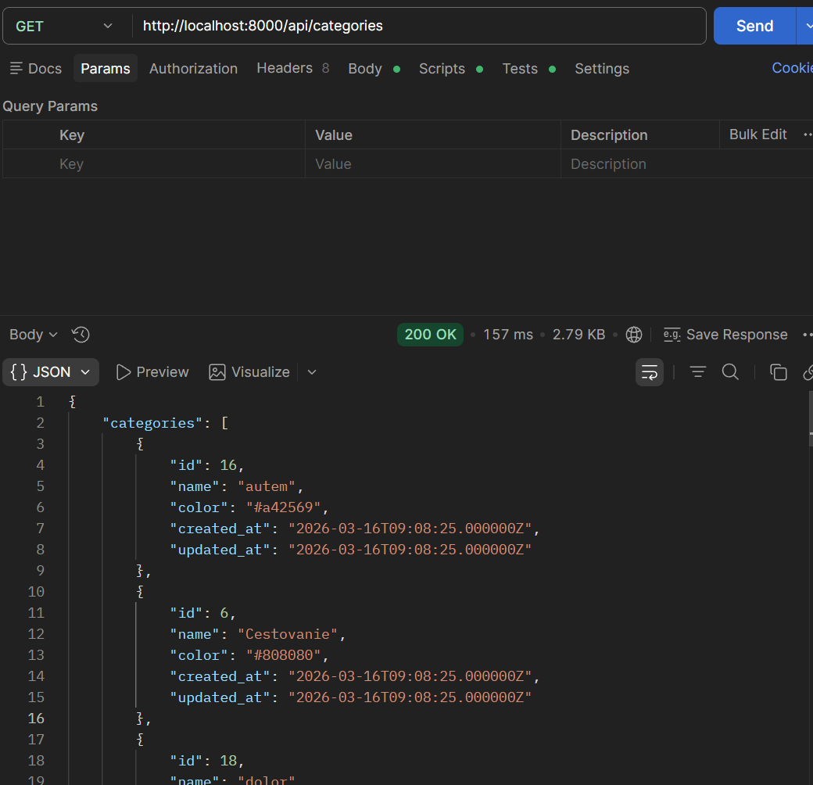
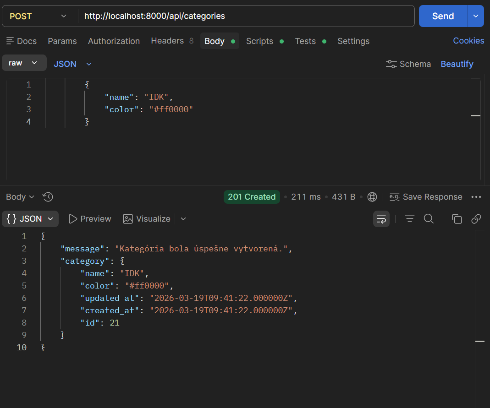
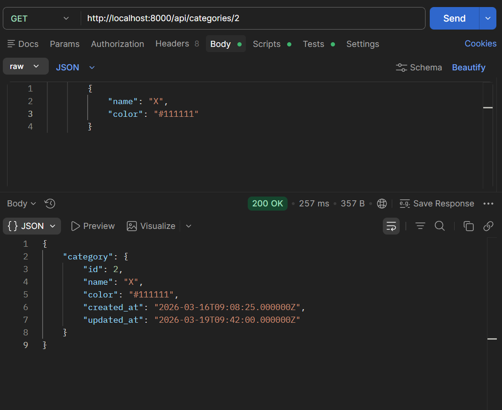
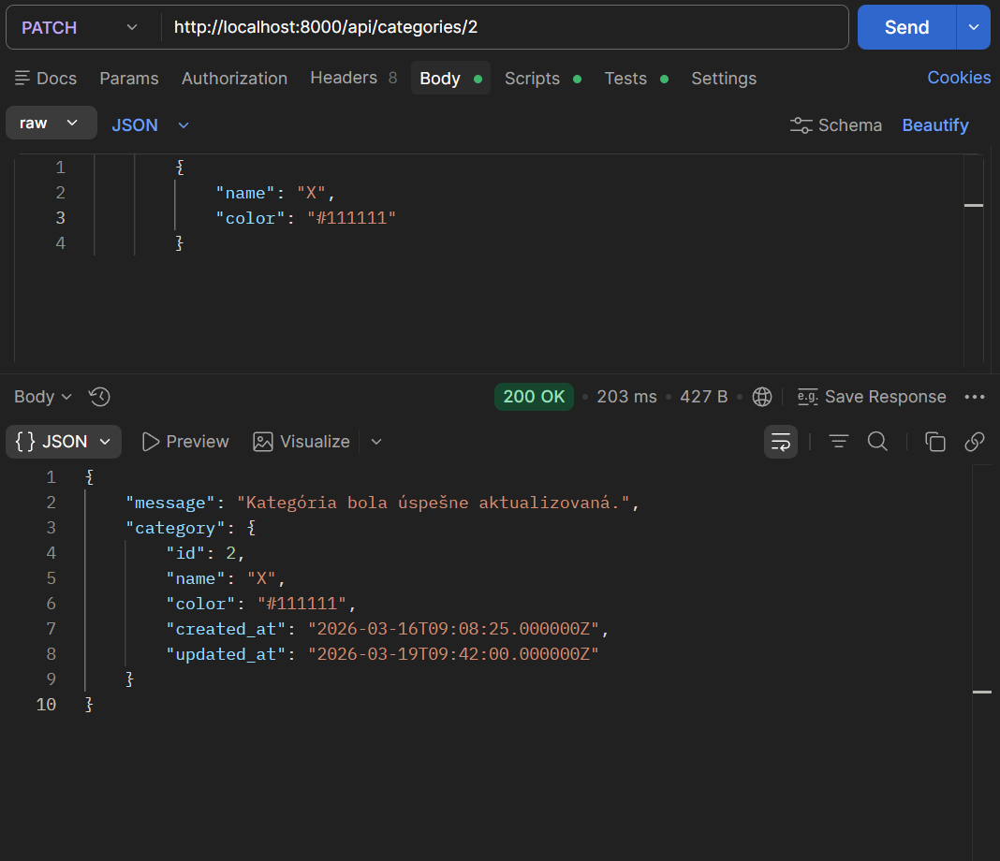
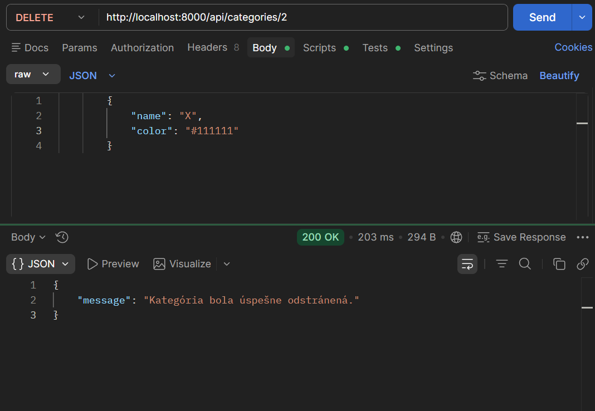

## Notes Custom

### GET /api/notes/stats/status

---

## Notes Actions (Eloquent)

### PATCH /api/notes/1/publish

### PATCH /api/notes/1/archive

### PATCH /api/notes/1/pin

### PATCH /api/notes/1/unpin

---

## Categories CRUD

### GET /api/categories

### POST /api/categories

### GET /api/categories/2

### PATCH /api/categories/2

### DELETE /api/categories/2

